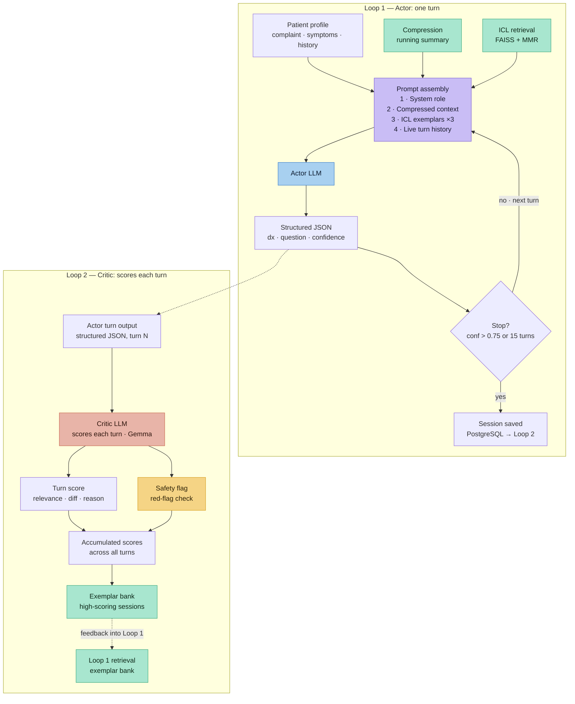

# DiffDx — AI-Assisted Medical Diagnostic System


DiffDx is a multi-turn AI diagnostic dialogue system built around an **Actor-Critic (A2C)** architecture. A doctor LLM (actor) conducts structured patient interviews to build a differential diagnosis. A separate critic LLM scores each turn for quality. The full pipeline — from conversation to specialist routing — is exposed through a web application with patient and doctor portals.

---

## Table of Contents

1. [Architecture Overview](#1-architecture-overview)
2. [The A2C Design](#2-the-a2c-design)
3. [Three-Loop Structure](#3-three-loop-structure)
4. [DDXPlus Dataset](#4-ddxplus-dataset)
5. [Quick Start](#5-quick-start)
6. [Directory Structure](#6-directory-structure)
7. [Configuration](#7-configuration)
8. [The Prompt System](#8-the-prompt-system)
9. [Locked Schemas](#9-locked-schemas)
10. [Loop 1 — Core Diagnostic Engine](#10-loop-1--core-diagnostic-engine)
11. [Loop 2 — Critic & Evaluation](#11-loop-2--critic--evaluation)
12. [Loop 3 — Specialist Routing](#12-loop-3--specialist-routing)
13. [Web Application](#13-web-application)
14. [Doctor Portal](#14-doctor-portal)
15. [Exemplars (ICL)](#15-exemplars-icl)
16. [Phase Progression](#16-phase-progression)
17. [Replication Guide](#17-replication-guide)
18. [Key Design Decisions](#18-key-design-decisions)
19. [Troubleshooting](#19-troubleshooting)
20. [Glossary](#20-glossary)

---

## 1. Architecture Overview

```
Patient Input
     │
     ▼
┌─────────────────────────────────────────────┐
│                  LOOP 1                      │
│  Profile Builder ──► Doctor LLM (Actor)      │
│       │                    │                 │
│  Exemplar Retrieval    Question + Diff       │
│  (FAISS + MMR)              │                │
│       │              Context Compressor      │
│       └──────────────────► │                 │
│                      Session Logger          │
└─────────────────────────────────────────────┘
     │ FinalRecord (JSON)
     ▼
┌─────────────────────────────────────────────┐
│                  LOOP 2                      │
│  DDXPlus Patient Simulator                   │
│  Critic LLM ──► TurnCritique scores          │
│  Ground-truth Evaluator ──► top-1 accuracy  │
└─────────────────────────────────────────────┘
     │
     ▼
┌─────────────────────────────────────────────┐
│                  LOOP 3                      │
│  Disease → Specialty Map                     │
│  Urgency Classifier ──► RoutingDecision      │
│  Ambiguity Handler (multi-specialty diff)   │
└─────────────────────────────────────────────┘
     │
     ▼
┌─────────────────────────────────────────────┐
│               WEB APP (FastAPI)              │
│  Patient Portal   │   Doctor Portal          │
│  session.html     │   doctor-portal.html     │
│  report.html      │   Pre-consultation brief │
│  my-sessions.html │   Prescription pad       │
│  booking flow     │   Test orders, referrals │
└─────────────────────────────────────────────┘
```

---

## 2. The A2C Design

The system is modelled on **Actor-Critic** reinforcement learning, adapted for language:

| RL Concept | DiffDx Equivalent |
|------------|-------------------|
| **Actor** | Doctor LLM — generates the next diagnostic question |
| **Action** | The chosen question + rationale + differential update |
| **State** | PatientProfile: accumulated symptoms, history, differential |
| **Environment** | Patient (real or simulated via DDXPlus) |
| **Critic** | Separate LLM — scores question quality post-turn |
| **Reward signal** | TurnCritique: `question_quality_score`, `differential_quality_score`, `reasoning_quality_score` |
| **Policy improvement** | Future: DPO on high-reward sessions (Loop 2 → 3+) |

**Why A2C instead of end-to-end training?**

Medical diagnosis has sparse, delayed rewards (correct diagnosis at the end) and long horizon (up to 15 turns). A turn-level critic provides dense intermediate feedback without requiring ground-truth labels for every turn. The critic evaluates reasoning quality, not just whether the final answer was correct.

**Current state**: The system collects critic-annotated sessions. Fine-tuning (DPO/LoRA) is deferred to a future loop. Everything built in this repository is the data-collection and architecture foundation for that.

### Turn-by-turn flow



Coral = critic (runs per turn) · amber = the safety red-flag check riding alongside it · teal =
the retrieval/exemplar-bank feedback loop back into Loop 1 (every session's turns get scored, and
high-scoring sessions feed the exemplar bank Loop 1's retriever draws from for future sessions —
today that's curation, not gradient-based fine-tuning; see "Current state" above).

---

## 3. Three-Loop Structure

| Loop | Code | Purpose | Status |
|------|------|---------|--------|
| **Loop 1** | `src/loop1/` | Diagnostic dialogue runtime | ✅ Complete |
| **Loop 2** | `src/loop2/` | Critic scoring + DDXPlus evaluation | ✅ Complete |
| **Loop 3** | `src/loop3/` | Specialist routing + urgency | ✅ Complete |
| **Web** | `web/` | Full-stack patient + doctor portal | 🔄 Phase 10 |

Each loop was built sequentially. Earlier loops do not depend on later ones. Loop 2 reads Loop 1's log files. Loop 3 reads Loop 1's final record.

---

## 4. DDXPlus Dataset

DDXPlus is a synthetic medical dataset used in **Loop 2** for automated evaluation.

**What it contains**:
- 70+ pathologies (diseases)
- ~200 symptoms and antecedents (risk factors/history items)
- Thousands of synthetic patient records, each with:
  - `age`, `sex`, `initial_evidence` (chief complaint code)
  - `evidences: dict[str, bool | str]` — symptom presence/absence/values
  - `antecedents: dict[str, bool]` — medical history
  - `ground_truth_pathology: str` — correct diagnosis label

**Download**: Not included in the repo (too large). Available from the original paper authors or via Kaggle/HuggingFace.

**How it's used here**:

1. **Patient Simulator** (`src/loop2/ddxplus/patient_simulator.py`): an LLM reads the DDXPlus record and answers the doctor's questions in natural language, truthfully but without leaking the ground truth diagnosis. After each response it checks for accidental mention of the pathology name and regenerates if found.

2. **Ground-truth Evaluator** (`src/loop2/ddxplus/evaluator.py`): after the session, compares the doctor's `primary_diagnosis` against `ground_truth_pathology`. Reports top-1 accuracy, top-3 containment, Jaccard overlap, and turns-to-correct.

3. **Eval Set** (`data/ddxplus_eval_set.json`): 20 hand-curated patient IDs committed to the repo. Stratified: 5 in-exemplar-pool, 10 out-of-pool, 5 ambiguous differentials.

**Key files**:
```
data/DDXPlus_Raw/           ← GITIGNORED, download separately
  release_conditions.json   ← disease metadata (name, synonyms, ICD codes)
  release_evidences.json    ← symptom definitions and value types
  release_train_patients    ← training split
  release_validate_patients ← val split
  release_test_patients     ← test split (used for eval)
data/ddxplus_eval_set.json  ← committed: 20 patient IDs for Phase 7 eval
```

**Loader** (`src/loop2/ddxplus/loader.py`):
```python
from loop2.ddxplus.loader import load_ddxplus_patient
patient = load_ddxplus_patient(patient_id, split="test")
# returns DDXPlusPatient with all evidences decoded to human-readable strings
```

---

## 5. Quick Start

### Prerequisites
- Python 3.12 (matches `.python-version`, the Dockerfile base image, and `render.yaml`)
- `uv` package manager (`pip install uv`)
- Groq API key (free at [console.groq.com](https://console.groq.com))

### Setup

```bash
# 1. Clone and enter
git clone https://github.com/Mhervin47/DiffDx
cd DiffDx/loop1

# 2. Install dependencies
uv sync

# 3. Set environment variables
cp .env.example .env
# Edit .env:
# GROQ_API_KEY=<your key>
# OPENROUTER_API_KEY=<optional fallback>

# 4. Sanity check
uv run python scripts/hello_world.py
# Expected: "hello world" LLM call succeeds, event logged

# 5. Embed exemplars (required once for retrieval)
.venv/bin/python scripts/embed_exemplars.py
# Expected: "EMBED ex_appendicitis_001 (384d)" for each file

# 6. Run a terminal session
.venv/bin/python scripts/run_session.py --profile test_cases/case_02.json

# 7. Run the web app
uv run python -m uvicorn web.api:app --reload --host 0.0.0.0 --port 8000
# Open http://localhost:8000
```

Alternatively, `docker compose up --build` from the repo root runs the same app alongside real
Postgres and Redis containers — no local Python/uv setup needed, see the root `README.md`. The
Docker image installs from `requirements-web.txt` (a subset of `requirements.txt` — the web
server never runs local inference/embedding, so it skips torch, the CUDA stack, and the other
offline AI-tooling packages `uv sync` installs for local dev).

### Environment Variables

```bash
GROQ_API_KEY=          # Required. Primary LLM provider.
OPENROUTER_API_KEY=    # Optional. First fallback on 429.
CEREBRAS_API_KEY=      # Optional. Second fallback.
GEMINI_API_KEY=        # Optional. Third fallback.
CRITIC_MODEL=          # Optional. Override critic model.
                       # Default: openrouter/meta-llama/llama-3.3-70b-instruct
DATABASE_URL=          # Optional. Postgres URL for production.
                       # Default: SQLite at web/data/diffdx.db
REDIS_URL=             # Optional. Live diagnostic-session state.
                       # Default: in-memory dict (single process, no restart survival)
```

See `.env.example` for the complete list, including JWT/CORS production requirements and optional
voice, multilingual, and SMTP integrations.

---

## 6. Directory Structure

```
loop1/
├── src/
│   ├── loop1/                        # Core diagnostic runtime
│   │   ├── schemas.py                # All Pydantic models (locked)
│   │   ├── config.py                 # config.yaml loader
│   │   ├── llm.py                    # LLM calls, fallback chain, JSON parsing
│   │   ├── doctor.py                 # Doctor turn: exemplar injection + LLM call
│   │   ├── session.py                # Multi-turn loop orchestrator
│   │   ├── retrieval.py              # FAISS index + MMR exemplar selection
│   │   ├── compressor.py             # Context compression (dedup + LLM summary)
│   │   ├── profile_updater.py        # Extract profile delta from Q&A
│   │   ├── safety.py                 # Emergency phrase detection
│   │   ├── closing_turn.py           # Patient-facing closing summary
│   │   └── logging_utils.py          # JSONL + FinalRecord I/O
│   │
│   ├── loop2/                        # Evaluation layer
│   │   ├── critic/
│   │   │   ├── critic.py             # Per-turn critic LLM call
│   │   │   ├── critique_schema.py    # TurnCritique schema
│   │   │   └── aggregator.py         # Roll up stats across sessions
│   │   ├── ddxplus/
│   │   │   ├── loader.py             # DDXPlus dataset parser
│   │   │   ├── patient_simulator.py  # LLM patient grounded in DDXPlus
│   │   │   ├── evaluator.py          # Ground-truth accuracy metrics
│   │   │   └── schemas.py            # DDXPlusPatient, DDXPlusEvalResult
│   │   └── runners/
│   │       └── phase7_eval.py        # 20-patient end-to-end eval pipeline
│   │
│   └── loop3/                        # Routing layer
│       └── routing/
│           ├── router.py             # Main routing orchestrator
│           ├── routing_schema.py     # RoutingDecision, RoutingOption
│           ├── urgency_classifier.py # Disease → urgency level
│           ├── ambiguity_handler.py  # Multi-specialty differential
│           └── map_loader.py         # Load disease_specialty_map.json
│
├── web/
│   ├── api.py                        # FastAPI app (all endpoints ~3000 lines)
│   ├── api_session.py                # APISession: stateful web session wrapper
│   └── static/                       # Vanilla HTML/CSS/JS, no frameworks
│       ├── index.html                # Case selection / landing
│       ├── patient-info.html         # Custom intake form
│       ├── session.html              # Live chat interface
│       ├── report.html               # Final diagnosis + routing + booking
│       ├── my-sessions.html          # Patient: past sessions + appointments
│       ├── doctor-portal.html        # Doctor: queue + session detail panel
│       ├── doctor-analytics.html     # Doctor stats dashboard
│       ├── doctor-profile.html       # Doctor profile settings
│       ├── find-doctors.html         # Specialist directory + booking
│       ├── book-slot.html            # Appointment slot picker
│       ├── pre-visit-intake.html     # Patient pre-visit check-in
│       ├── notifications.html        # Patient notifications
│       ├── messages.html             # In-app messaging
│       ├── health-history.html       # Patient health history
│       ├── my-profile.html           # Patient profile
│       ├── login.html                # Auth (patient + doctor roles)
│       ├── auth.js                   # JWT helpers shared across pages
│       ├── patient-nav.js            # Patient navigation helpers
│       └── styles.css                # Global dark theme
│
├── prompts/                          # Versioned prompt templates
│   ├── doctor_v0_6.txt               # Current (active)
│   ├── doctor_v0_{1-5}.txt           # Archived for replay
│   ├── compressor_v0_2.txt
│   ├── profile_updater_v0_3.txt
│   ├── critic_turn_v0_1.txt
│   └── simulated_patient_v0_1.txt
│
├── exemplars/                        # Hand-curated clinical examples (~50 files)
│   └── ex_*.json                     # All frozen: true
│
├── test_cases/                       # Manual test patient profiles
│   └── case_0{1-6}.json
│
├── data/
│   ├── DDXPlus_Raw/                  # GITIGNORED — download separately
│   ├── ddxplus_eval_set.json         # 20-patient eval set (committed)
│   └── disease_specialty_map.json    # 70+ disease → specialty + urgency
│
├── logs/
│   ├── sessions/                     # JSONL (one per session, incremental)
│   └── final_records/                # FinalRecord JSON (one per session)
│
├── scripts/                          # Dev utilities
├── tests/                            # pytest suite (~60 tests)
├── config.yaml                       # All tunable parameters
├── pyproject.toml                    # Package definition (uv)
├── requirements.txt                  # pip fallback
└── CLAUDE.md                         # Original Loop 1 spec (authoritative)
```

---

## 7. Configuration

All tunable parameters live in `config.yaml`. The web app reads this at startup.

```yaml
models:
  doctor:          openrouter/meta-llama/llama-3.1-8b-instruct   # Actor LLM
  compressor:      openrouter/nvidia/nemotron-3-super-120b-a12b:free   # Context compression
  profile_updater: openrouter/nvidia/nemotron-3-super-120b-a12b:free   # Profile delta extraction
  embedder:        sentence-transformers/all-MiniLM-L6-v2  # 384-dim local

prompt_versions:
  doctor:          v0.6     # Maps to prompts/doctor_v0_6.txt
  compressor:      v0.2
  profile_updater: v0.3

thresholds:
  confidence_to_stop:        0.55   # Doctor stops when confidence >= this
  max_turns:                 15     # Hard cap
  compression_keep_recent:   3      # Keep last N turns verbatim; compress older
  compression_token_threshold: 3000 # Compress when prompt exceeds this
  top_k_exemplars:           3      # Exemplars injected per doctor turn
  mmr_lambda:                0.5    # 0=pure diversity, 1=pure similarity
  llm_temperature:           0.3
  llm_max_tokens:            2048
  exemplar_pool_size:        50

logging:
  session_dir:    logs/sessions
  final_dir:      logs/final_records
  schema_version: 0.5.0
```

---

## 8. The Prompt System

### Philosophy

Prompts are treated as **immutable after deployment**. Every prompt file carries a version suffix (`_v0_6`). Old logs reference their prompt version so sessions can be replayed exactly, and A/B comparisons between versions are clean.

Never edit an existing prompt in place. Instead:
1. Copy `doctor_v0_6.txt` to `doctor_v0_7.txt`
2. Make changes
3. Update `config.yaml` → `prompt_versions.doctor: v0.7`
4. Run `scripts/bake_off.py` to compare on the same test cases

### Doctor Prompt (`prompts/doctor_v0_6.txt`) — Key Rules

The doctor prompt is the most important and most iterated prompt in the system. Here are the rules enforced as of v0.6:

**Output format** (strict JSON, no markdown fences):
```json
{
  "turn_index": 3,
  "current_differential": [{"dx": "Viral Pharyngitis", "prob": 0.55}, ...],
  "biggest_uncertainty": "whether fever is present",
  "candidate_questions": ["q1", "q2", "q3"],
  "chosen_question": "Do you have a fever, and if so, how high?",
  "rationale": "Patient mentioned throat pain at turn 1...",
  "confidence_to_stop": 0.42,
  "should_stop": false,
  "safety_flags": []
}
```

**Base-rate calibration (turn 0)**:
- Common causes (viral illness, tension headache, MSK strain) must collectively hold ≥ 0.55 probability
- Serious/rare diseases start ≤ 0.10–0.15 unless a specific red-flag symptom is present
- Red flags that justify raising a serious diagnosis >0.20 at turn 0: haemoptysis, unexplained weight loss >5 kg, night sweats >2 weeks, palpable mass, focal neurological deficit, syncope, severe chest pain radiating to jaw/arm

**Confidence calibration anchors**:
| Range | Meaning |
|-------|---------|
| 0.0–0.2 | Multiple plausible diagnoses; major gaps remain |
| 0.3–0.5 | Working hypothesis; key discriminators unanswered |
| 0.6–0.75 | Strong lead; additional questions yield diminishing returns |
| 0.8+ | Ready to commit; `should_stop` must be `true` |

**Decisive closure rule**: If leading diagnosis > 0.65 AND second-ranked < 0.20 → set `confidence_to_stop ≥ 0.75` and `should_stop = true`.

**Differential updating rules**:
- Every confirmed finding raises relevant diagnoses by ≥ 0.10
- Every denied finding lowers relevant diagnoses by ≥ 0.10
- A diagnosis leaves the differential **only** when the patient has denied a pathognomonic finding — not just any denial
- Static probabilities across turns = critical failure (evidence not being incorporated)

**Mandatory initial differential breadth**:
- Chest pain → must include thromboembolic (ACS, PE) AND inflammatory cardiac (pericarditis)
- Shortness of breath → must include PE, pneumonia, heart failure, asthma/COPD
- Joint/muscle pain → must include systemic/autoimmune (SLE, RA) alongside local MSK
- Severe/unusual headache → must include SAH and meningitis

**Systemic screening rule** (joint/muscle pain):
The question "Is the pain only here, or do you also have pain/stiffness in other joints?" is mandatory at turn 1 or 2, before any other line of questioning. Non-negotiable.

**Communication style**: Plain language — "blood clot" not "DVT", "irregular heartbeat" not "arrhythmia", "scan of your lungs" not "CT pulmonary angiogram".

**Exemplar usage**: Apply the *reasoning pattern* from injected exemplars; never copy the question text verbatim.

### Prompt Version History

| Version | Key addition |
|---------|-------------|
| v0.1 | Basic role + output schema |
| v0.2 | CoT rationale field |
| v0.3 | Confidence calibration anchors |
| v0.4 | Mandatory differential breadth rules (ACS+PE for chest pain, etc.) |
| v0.5 | Systemic screening rule for joint pain |
| v0.6 | Base-rate calibration + evidence-based differential updating rules |

### Other Prompts

**`profile_updater_v0_3.txt`** — extracts a `ProfileDelta` from a Q&A pair:
- Never infer; only extract what patient explicitly stated
- Denied symptoms do not create entries and do not go into `ruled_out`
- `ruled_out` is for diagnoses only, never for denied symptoms
- `social` history = lifestyle only (no symptoms here)
- Check existing symptoms before adding new ones; update rather than duplicate

**`compressor_v0_2.txt`** — generates a `running_summary` from older turns:
- "Extract only, never infer"
- Output: confirmed symptoms with timeline, ruled-in/ruled-out, important negatives, open questions
- Target: 2–4 sentences that capture everything a doctor needs to continue from turn N

**`critic_turn_v0_1.txt`** — scores a doctor turn:
- Does NOT receive the ground-truth diagnosis
- Does NOT receive the patient's answer (evaluates the question before the response)
- Scores: question quality, differential quality, reasoning quality (all 0.0–1.0)
- Labels: confidence calibration, weakness category, suggested better question

**`simulated_patient_v0_1.txt`** — DDXPlus patient simulator:
- Grounded in the structured DDXPlus record
- Forbidden from revealing the diagnosis name
- Must remain consistent with previously disclosed symptoms
- Natural, non-clinical language

---

## 9. Locked Schemas

These schemas are **frozen after Phase 2**. Fields can be added; they cannot be renamed or removed. All log readers, the critic, and the evaluator depend on this.

### PatientProfile
```python
class PatientProfile(BaseModel):
    session_id:       str
    demographics:     Demographics     # age, sex, other
    chief_complaint:  str
    symptoms:         list[Symptom]    # CURRENT presenting symptoms only
    history:          History          # PAST/chronic; NOT current symptoms
    ruled_out:        list[str]        # diagnoses ruled out (not denied symptoms)
    ruled_in:         list[str]
    free_notes:       str
    running_summary:  str              # LLM-compressed summary from compressor.py

class Symptom(BaseModel):
    name:     str    # e.g. "chest pain"
    onset:    str    # e.g. "3 days ago"
    severity: str    # "mild" | "moderate" | "severe"
    notes:    str

class History(BaseModel):
    medical:     list[str]   # prior diagnoses, chronic conditions
    medications: list[str]
    allergies:   list[str]
    family:      list[str]
    social:      list[str]   # smoking, alcohol, occupation, diet, exercise ONLY
```

### DoctorTurnOutput
```python
class DoctorTurnOutput(BaseModel):
    turn_index:          int
    current_differential: list[DiagnosisEntry]  # [{dx, prob}]
    biggest_uncertainty:  str
    candidate_questions:  list[str]
    chosen_question:      str
    rationale:            str
    confidence_to_stop:   float   # 0.0–1.0
    should_stop:          bool    # true if confidence_to_stop >= threshold
    safety_flags:         list[str]
```

### FinalRecord
```python
class FinalRecord(BaseModel):
    schema_version:    str = "0.5.0"
    session_id:        str
    started_at:        str    # ISO8601
    ended_at:          str
    termination_reason: Literal[
        "confidence_threshold", "max_turns", "safety_stop", "user_quit"
    ]
    final_profile:     PatientProfile
    final_differential: list[DiagnosisEntry]
    primary_diagnosis:  str
    turn_history:       list[TurnRecord]
    model_metadata:     ModelMetadata
    closing_turn:       ClosingTurn | None
```

### Exemplar
```python
class Exemplar(BaseModel):
    exemplar_id:       str      # "ex_appendicitis_001"
    tags:              list[str]
    context_summary:   str      # embedded for retrieval
    good_next_question: str
    rationale:         str
    frozen:            bool     # true = permanent seed set
    embedding:         list[float] | None  # 384-dim, from embed_exemplars.py
```

---

## 10. Loop 1 — Core Diagnostic Engine

### LLM Interface (`llm.py`)

All LLM calls go through a single module. No other code imports an LLM client directly.

**Fallback chain** (triggered on 429, no blocking sleep):
```
openrouter/meta-llama/llama-3.3-70b-instruct
  → groq/meta-llama/llama-4-scout-17b-16e-instruct
  → openrouter/[free models]
  → cerebras/[models]
  → gemini/[models]
```

On 429: immediate next provider. On 5xx: exponential backoff via `tenacity`. The model actually used is logged in `model_metadata`.

**Key functions**:
```python
call_llm(model, messages, **kwargs) -> str
call_llm_json(model, messages, max_parse_retries=3, **kwargs) -> dict
    # On JSON parse failure: feed error back to LLM, retry up to 3x
```

### Doctor Turn (`doctor.py`)

Per-turn flow:
1. Build embedding query from `chief_complaint + running_summary + top 5 symptoms`
2. FAISS + MMR → retrieve 3 exemplars
3. Load `prompts/doctor_v{version}.txt`
4. Assemble prompt: system (rules + exemplars) + user (profile JSON + turn history)
5. LLM call → strip markdown fences → parse JSON → validate Pydantic → retry if invalid

### Exemplar Retrieval (`retrieval.py`)

- **Embedding model**: `all-MiniLM-L6-v2` (384-dim, lazy-loaded, runs locally)
- **Index**: FAISS flat inner-product (cosine similarity via unit normalization)
- **Algorithm**: MMR (Maximal Marginal Relevance)
  ```
  score(e) = λ · sim(query, e) - (1-λ) · max_sim(e, already_selected)
  ```
  λ = 0.5 by default: equal weight on relevance and diversity

### Context Compression (`compressor.py`)

Triggered at turn 4+ when history exceeds `keep_recent` (default 3).

**Stage 1 — Code-level dedup** (no LLM):
- Symptom merging: exact match → substring → content-word subset → Jaccard >80%
- History lists: case-insensitive dedup
- Free notes: sentence-level dedup

**Stage 2 — LLM recategorization**:
- Fixes miscategorized items (e.g. current symptoms that ended up in `history.medical`)
- Generates `running_summary`: 2–4 sentences of confirmed symptoms, timeline, ruled-in/out
- Anti-hallucination instruction: "extract only, never infer"

Result: last 3 turns pass verbatim; everything older is in `running_summary`.

### Profile Updater (`profile_updater.py`)

After each patient answer:
```python
delta = extract_profile_delta(profile, question, answer)
new_profile = apply_delta(profile, delta)
```

`ProfileDelta` captures: new symptoms, updates to existing symptoms, history additions, diagnosed ruled in/out, free notes additions. Never mutates the original profile.

### Session Loop (`session.py`)

```python
session = Session(
    profile=initial_profile,
    max_turns=15,
    confidence_threshold=0.55,
    patient_source=None  # None = interactive; or SimulatedPatient
)
record = session.run()
```

Per-turn: doctor generates turn → safety check → stop check → get answer → log → update profile → compress → repeat.

Post-loop: `closing_turn.generate_closing_turn()` → assemble `FinalRecord` → write JSON.

### Safety Layer (`safety.py`)

Hard-coded trigger phrases:
```
can't breathe, cannot breathe, face drooping, unresponsive,
severe bleeding, suicidal, kill myself, throat swelling,
seizure, overdose
```

On match: immediate `termination_reason = "safety_stop"`, display emergency services message.

---

## 11. Loop 2 — Critic & Evaluation

### Critic (`critic.py`)

Scores one doctor turn post-session. Does NOT see the ground-truth diagnosis or the patient's actual answer — it evaluates the doctor's question before seeing the response.

```python
critique = critique_turn(turn_event, session_events, session_id)
```

**TurnCritique fields**: `question_quality_score`, `differential_quality_score`, `reasoning_quality_score` (all 0.0–1.0), `confidence_calibration` ("well-calibrated"/"overconfident"/"underconfident"), `weakness_category`, `would_have_asked`, `rationale`.

**Critic model**: Configurable via `CRITIC_MODEL` env var. Default: `openrouter/meta-llama/llama-3.3-70b-instruct`. Must be a different model from the doctor to avoid self-evaluation bias.

### DDXPlus Patient Simulator (`patient_simulator.py`)

```python
sim = SimulatedPatient(ddxplus_record)
complaint = sim.initial_complaint()          # "I've been having chest pain..."
answer = sim.answer(doctor_question)          # LLM grounded in DDXPlus record
```

**Guardrails**:
1. Never invents symptoms not in the DDXPlus record
2. Post-hoc leakage scan: if response contains the pathology name → regenerate (up to 3 retries)
3. Tracks `disclosed_symptoms` for cross-turn consistency

### Ground-Truth Evaluator (`evaluator.py`)

No LLM calls. Pure string matching against `ground_truth_pathology`.

**Metrics**: top-1 accuracy, top-3 containment, Jaccard overlap, turns-to-correct-diagnosis, whether the disease was in the exemplar pool.

### Phase 7 Eval Runner (`runners/phase7_eval.py`)

Runs 20 patients end-to-end. Resumable (skips patients with existing JSONL logs). Outputs `phase7_findings.md` with aggregate stats.

```bash
.venv/bin/python -m loop2.runners.phase7_eval
```

---

## 12. Loop 3 — Specialist Routing

### What it does

After a session completes, the final differential is mapped to medical specialties with urgency levels and appointment types.

```python
from loop3.routing.router import route

decision = route(
    session_id="...",
    final_differential=[("Pulmonary Embolism", 0.55), ("Pneumonia", 0.30)],
    final_confidence=0.55,
)
# decision.primary_routing.specialty = "Pulmonology"
# decision.primary_routing.urgency = UrgencyLevel.EMERGENCY
```

### Disease → Specialty Map (`data/disease_specialty_map.json`)

70+ entries. Format:
```json
"Pulmonary embolism": {
  "specialty": "Pulmonology",
  "urgency": "emergency",
  "appointment_type": "emergency_visit",
  "reasoning": "PE is life-threatening, requires immediate anticoagulation"
}
```

**Safety override**: Any emergency-level disease in the differential becomes `primary_routing` regardless of probability. A 20% PE always surfaces above an 80% musculoskeletal strain.

**Confidence adjustment**: If `final_confidence < 0.4` and base urgency is `routine` → bumped to `urgent`.

### Ambiguity Detection

If top specialty's probability-weighted score < 1.5× second specialty's score → `is_ambiguous = True`. Returns 2–3 `alternative_routings` alongside `primary_routing`.

### RoutingDecision Schema

```python
class RoutingDecision(BaseModel):
    schema_version:       str = "0.9.0"
    session_id:           str
    is_ambiguous:         bool
    primary_routing:      RoutingOption
    alternative_routings: list[RoutingOption]
    final_differential:   list[tuple[str, float]]
    final_confidence:     float
    routing_model_version: str
```

---

## 13. Web Application

### Backend (`web/api.py`)

FastAPI + uvicorn. ~3000 lines covering all patient and doctor workflows.

**Auth**: JWT tokens in `localStorage`, sent as `Authorization: Bearer <token>`. Two roles: `patient` and `doctor`.

**Storage**: SQLite via `web/data/diffdx.db` (local) or Postgres (production via `DATABASE_URL`). All data stored as JSON blobs in a single `store` table keyed by collection name.

**Session state**: In-memory `dict[str, APISession]`. Lost on server restart — users mid-session must start over. Final records are DB-persisted and survive restarts.

**Key endpoint groups**:

```
# Auth
POST /api/auth/register                Patient sign-up (sends a Resend welcome email, best-effort)
POST /api/auth/login                   Returns access + refresh JWT + role
POST /api/auth/refresh                 Rotate a refresh token for a new access/refresh pair
POST /api/auth/logout                  Revoke a refresh token
POST /api/auth/forgot-password         Email a 6-digit reset code (generic response either way — no account enumeration)
POST /api/auth/reset-password          Verify the code, set a new password, revoke other sessions
GET  /api/auth/me                      Current user

# Diagnostic session
POST /api/session/start                From predefined case
POST /api/session/start-custom         From intake form
POST /api/session/{id}/turn            Patient answer → next doctor question
GET  /api/session/{id}/report          FinalRecord when complete
GET  /api/auth/sessions                Patient's session history (with backfill)

# Routing & booking
GET  /api/session/{id}/routing         RoutingDecision + matching doctors
POST /api/session/{id}/book            Book appointment slot
GET  /api/appointments                 Patient's appointments
PATCH /api/patient/appointments/{id}/reschedule-response  Accept/decline reschedule

# Doctor portal
GET  /api/doctor/appointments          Doctor's appointment queue
PATCH /api/doctor/appointments/{id}/prescriptions  Save prescription pad
PATCH /api/doctor/appointments/{id}/tests          Save test orders
PATCH /api/doctor/appointments/{id}/notes          Save doctor notes
PATCH /api/doctor/appointments/{id}/status         Mark seen/no_show/cancelled
PATCH /api/doctor/appointments/{id}/plan           Save approved plan
POST  /api/doctor/appointments/{id}/followup       Create follow-up appointment
POST  /api/doctor/appointments/{id}/propose-reschedule  Propose new slot
```

### Frontend (`web/static/`)

Vanilla HTML/CSS/JS. No React, no Vue, no build step. Every page is a self-contained HTML file that imports `auth.js` and `styles.css`.

**Design system**:
- Background: `#070912`
- Surface: `rgba(255,255,255,.025)`
- Accent teal: `#00b4d8`
- Success green: `#10b981`
- Danger red: `#ef4444`
- Font: Inter (Google Fonts)
- Nav: sticky full-width glassmorphism bar with animated shimmer border

**Auth flow**: `auth.js` stores JWT in `localStorage` with an 8-hour expiry. All pages check auth on load; expired sessions show a toast and redirect to login.

---

## 14. Doctor Portal

The doctor portal (`doctor-portal.html`) is the most complex frontend page. Key features:

### Patient Queue (Sidebar)

- Lists all appointments for the logged-in doctor
- Filter chips: All · Today · Urgent · Completed
- Completed patients hidden by default (server-persisted `status` field: `seen`/`no_show`/`cancelled`)
- Glassmorphism card with animated gradient flow on doctor profile section

### Patient Detail Panel

When a patient is selected, the panel shows:

1. **Pre-Consultation Brief** — auto-generated before the doctor reads the chart:
   - Chief complaint + AI confidence %
   - Symptom chips with severity
   - Differential bars (top 4)
   - Allergies / medications / past medical history in 3 columns
   - Ruled in / ruled out lists
   - Doctor's Plan section

2. **Voice Brief** — browser `SpeechSynthesis` reads the brief aloud on demand, via a manual
   "Read brief aloud" button (not auto-played when a patient is opened — it used to auto-play on
   selection, which doctors found intrusive when clicking through several patients in a row, so
   that trigger was removed in favor of an explicit toggle):
   - Patient name + demographics
   - Chief complaint
   - Reported symptoms
   - Predicted diagnosis (top-1, no percentages)
   - Allergies, medications, past medical history
   - Toggle button with animated speaking bars

3. **Conversation Transcript** — full turn-by-turn dialogue

4. **Differential Timeline** — bar chart per turn showing how the differential evolved

5. **Critic Scores** — per-turn quality table (question quality, differential quality, reasoning quality)

6. **Doctor's Tools**:
   - Prescription pad (drug, dose, route, frequency, duration, meal timing, notes)
   - Test orders (blood / imaging / other, priority levels)
   - Doctor notes (auto-save with 1.5s debounce)
   - Approved plan checklist
   - Referral to specialist
   - Follow-up scheduler
   - Status bar: Upcoming / Seen ✓ / No-show

   Prescriptions, case reports, and referral letters each print/export as a consistent
   letterhead-style PDF — gradient hospital banner, a doctor identity strip (avatar initials, name,
   specialty, license — pulled from the signed-in doctor's own profile rather than left blank when
   unset), a bordered patient-info card, and a signature footer.

### Save & Done

`saveDone()` flushes all pending data to the server before dismissing the patient. Specifically, it awaits: `saveRx()`, `saveTestOrders()`, `savePlan()`, `saveNotes()` — ensuring the patient portal immediately reflects doctor additions.

---

## 15. Exemplars (ICL)

Exemplars are the **in-context learning** component of the system. They demonstrate strong diagnostic reasoning to the doctor LLM at inference time.

### Format

```json
{
  "exemplar_id": "ex_pulmonary_embolism_001",
  "tags": ["chest_pain", "shortness_of_breath", "emergency", "thromboembolic"],
  "context_summary": "35yo F on OCP, presents with sudden onset pleuritic chest pain and mild dyspnoea. Differential includes PE, pleuritis, MSK. No prior clots. Wells score being assembled.",
  "good_next_question": "Have you had any recent long journeys, or been sitting still for long periods — like a long flight or car trip?",
  "rationale": "Immobilisation is the highest-yield Wells criterion not yet addressed. Confirmation would push PE above 0.5 and mandate same-day imaging. It is also a closed question that the patient can answer unambiguously, unlike asking about family history which would take multiple turns to assess.",
  "frozen": true,
  "embedding": [0.021, -0.134, ...]
}
```

### Adding Exemplars

1. Create `exemplars/ex_[condition]_001.json` with `"embedding": null`
2. Fill in all fields
3. Run: `.venv/bin/python scripts/embed_exemplars.py`

The script is idempotent — skips files that already have embeddings.

### What Makes a Good Exemplar

- **Specificity**: describes a precise moment in a dialogue, not a generic scenario
- **Non-obvious question**: the insight must be the *why*, not the *what*
- **Transferable rationale**: explains the reasoning pattern so it applies to similar (not identical) cases
- **Diversity**: the pool should cover different organ systems, age groups, urgency levels, and question types (red-flag screen, timeline pin, differential narrower, knowing-when-to-stop)

### Current Pool (~50 exemplars)

Covers: PE, ACS, appendicitis, DVT, pericarditis, SAH, meningitis, SLE, RA, biliary colic, cauda equina syndrome, CVST, pregnancy screen, pediatric infectious workup, stimulant-induced ACS, cellulitis vs DVT, ENT conditions (SSNHL, AOM, PTA, OE, ETD, ABRS, epistaxis, hoarseness, peds FB, vertigo), and clinical judgment scenarios (patient asks question back, knowing when to stop).

---

## 16. Phase Progression

| Phase | Goal | Status |
|-------|------|--------|
| 0 | Setup, schemas, config, hello world | ✅ |
| 1 | Single-turn `generate_turn()` from hand-written profile | ✅ |
| 2 | Multi-turn CLI loop + crash-safe JSONL logging | ✅ |
| 3 | Context compression (2-stage: dedup + LLM summary) | ✅ |
| 4 | Static ICL exemplars (random selection, 3 per turn) | ✅ |
| 5 | Dynamic FAISS retrieval + MMR | ✅ |
| 6 | Hardening: replay mode, safety layer, schema versioning | ✅ |
| 7 | Turn-level critic + DDXPlus evaluation (N=20) | ✅ |
| 8 | *(reserved for exemplar mining from high-critic sessions)* | — |
| 9 | Disease → specialty routing (Loop 3) | ✅ |
| 10 | Full web app: patient portal + doctor portal | 🔄 Active |

**Deferred to future loops**:
- DPO / LoRA fine-tuning on critic-annotated sessions
- Critic-in-the-loop at inference time (real-time quality gate)
- Exemplar mining: automatically promote high-critic sessions to exemplar pool
- Production auth (OAuth, real email verification)
- Real provider/clinic booking API integration
- Multimodal input (images, EHR, audio)
- FHIR integration

---

## 17. Replication Guide

### If you're starting from scratch with Claude Code

1. **Read `CLAUDE.md` first.** It is the original spec. Every architectural decision traces back to it. The phases there are still the ground truth for Loop 1.

2. **Follow phases in order.** Each phase has a clear exit criterion. Do not start Phase 3 until Phase 2's exit criteria are met.

3. **Lock schemas early.** Define `schemas.py` in Phase 0 and commit to it. Every other file imports from it. Renaming a field in Phase 5 breaks replay of Phase 2 sessions.

4. **Version prompts from day one.** Name your first prompt `doctor_v0_1.txt`. When you change anything, copy to `doctor_v0_2.txt`. Never edit a prompt in place.

5. **Embed exemplars after every addition.** `embed_exemplars.py` is idempotent. If you add an exemplar and forget to embed it, retrieval silently skips it.

6. **The critic needs a different model from the doctor.** Self-scoring is not useful. Use `CRITIC_MODEL` env var to point to a different provider.

7. **Test the compressor in isolation before turning it on.** A broken compressor silently loses information. Use `test_cases/` to verify `running_summary` captures the right content.

### Recreating the web app

The web app is in `web/api.py` (FastAPI, ~3000 lines). It uses SQLite by default. To run in production:

```bash
# Heroku / Railway
DATABASE_URL=postgres://...   # triggers Postgres mode
GROQ_API_KEY=...
gunicorn --workers 1 --worker-class uvicorn.workers.UvicornWorker web.api:app
```

The frontend is plain HTML/CSS/JS in `web/static/`. No build step needed. `StaticFiles` is mounted at `/` in `api.py`. Individual HTML routes are also registered explicitly to set no-cache headers.

**One important implementation detail**: sessions started before the user logs in (anonymous sessions) are not automatically linked to the user account. The `/api/auth/sessions` endpoint handles this by scanning the user's appointments on every call and backfilling any orphaned sessions. The `/api/session/{id}/book` endpoint also adds the session to the user's list at booking time.

### Running the full eval pipeline

```bash
# Step 1: Embed exemplars
.venv/bin/python scripts/embed_exemplars.py

# Step 2: Run 20-patient evaluation
.venv/bin/python -m loop2.runners.phase7_eval
# Outputs: phase7_findings.md, logs/sessions/*, logs/final_records/*

# Step 3: Inspect critic scores on a specific session
.venv/bin/python scripts/inspect_session.py --session-id <uuid>

# Step 4: Replay a session with a new prompt version
.venv/bin/python scripts/replay_session.py --session-id <uuid>
```

---

## 18. Key Design Decisions

### 1. No blocking sleeps on rate limits
When a 429 is returned, the system immediately tries the next provider in the fallback chain. This keeps sessions responsive but means the fallback model (potentially weaker) may handle a turn. The model used is always logged in `model_metadata`.

### 2. Dedup before compression
The first stage of context compression is code-level deduplication (no LLM, deterministic). This catches the most common issue — duplicate symptom entries from multiple mentions of the same symptom — without the risk of hallucination from an LLM summary.

### 3. Safety wins over probability in routing
If any diagnosis in the differential carries emergency urgency, it becomes `primary_routing` regardless of its probability weight. A 20% PE routes to emergency care ahead of an 80% benign diagnosis. This is intentional: false negatives for emergencies are far more costly than false positives.

### 4. `session_id` is the foreign key across the whole system
The session_id ties together: the session JSONL, the FinalRecord, the appointment, the patient's session history, and the session_report in the DB. Every component that needs cross-entity access uses it.

### 5. Frozen exemplars are permanent
The `frozen: true` seed set is never deleted or evicted. Future phases may add machine-generated exemplars with `frozen: false` that can be pruned based on critic scores. The seed set guarantees baseline coverage of the core clinical scenarios.

### 6. Schema versioning discipline
Every log entry and API response carries `schema_version`. Schemas are additive-only — no renames, no removals. This guarantees forward-compatible parsing: Phase 7 eval can read logs written in Phase 2 without modification.

---

## 19. Troubleshooting

| Issue | Likely cause | Fix |
|-------|-------------|-----|
| `GROQ_API_KEY not set` | Missing env var | Add to `.env` in `loop1/` |
| FAISS fails at startup | Exemplars missing embeddings | Run `embed_exemplars.py` |
| `ImportError: PreTrainedModel` | Wrong Python env | Use `.venv/bin/python`, not `python3` |
| Confidence never crosses threshold | Model sandbagging | Lower `confidence_to_stop` to 0.4 temporarily; inspect `logs/` |
| Doctor asks same question twice | History not in prompt, or retrieval broken | Run `eval_retrieval.py`; check `turn_history` is being passed |
| Symptoms in `history.medical` | LLM miscategorization | Check compressor; add examples to `profile_updater_v0_3.txt` |
| Web sessions lost on restart | In-memory state only | Expected; use DB-persisted reports for recovery |
| Critic scores 0 or unavailable | Critic model quota or config | Check `CRITIC_MODEL`; run critic manually on a saved JSONL |
| Patient sessions not showing doctor updates | Old `_apptMap` logic | Ensure `my-sessions.html` uses the scoring-based `_apptMap` logic (seen+data=25 > upcoming+noData=20) |
| Replay non-deterministic | Temperature > 0 or unseeded RNG | Set `temperature=0` and pass `rng=np.random.default_rng(seed)` to retrieval |

---

## 20. Glossary

| Term | Definition |
|------|-----------|
| **Actor** | The doctor LLM — generates the next diagnostic question (A2C Actor) |
| **Critic** | Separate LLM — scores question quality post-turn (A2C Critic) |
| **Chief complaint** | Patient's primary reason for the visit |
| **Differential** | Ranked list of candidate diagnoses with probabilities |
| **DDXPlus** | Synthetic medical dataset of 70+ conditions used for Phase 7 evaluation |
| **Exemplar** | Hand-curated clinical example showing strong diagnostic reasoning at a specific moment in a dialogue |
| **ICL** | In-Context Learning — injecting examples into the prompt to guide model behaviour without fine-tuning |
| **MMR** | Maximal Marginal Relevance — retrieval algorithm balancing query similarity vs. diversity among retrieved items |
| **Profile delta** | Structured extraction of new information from one patient answer |
| **Running summary** | LLM-compressed narrative of dialogue turns 0 to N-3, stored in `profile.running_summary` |
| **Turn** | One Q&A cycle: doctor asks, patient answers |
| **Context compression** | Replacing raw old turns with a running summary to keep the prompt within token limits |
| **Safety flag** | Emergency phrase in patient input → immediate session termination |
| **Confidence threshold** | `confidence_to_stop` value at which the doctor stops asking (default 0.55) |
| **Frozen exemplar** | Seed-set exemplar that is never evicted, even when new ones are added |
| **Routing** | Mapping the final diagnosis to a medical specialty + urgency + appointment type |
| **Base-rate calibration** | Turn 0 rule: common diagnoses must have high initial probability before being suppressed by questioning |
| **Evidence-based update** | Rule: differential probabilities must shift by ≥ 0.10 per confirmed/denied finding |
| **Leakage** | Patient simulator accidentally revealing the ground-truth diagnosis — detected and regenerated |
| **Schema version** | Version field on every log entry ensuring forward-compatible parsing across phases |
| **Prompt version** | Filename suffix (v0.6) identifying which template generated a session — enables exact replay |
| **A2C** | Actor-Critic architecture: actor generates questions, critic scores them, future loops use scores for DPO fine-tuning |
| **DPO** | Direct Preference Optimization — fine-tuning technique planned for future loops using critic-annotated session pairs |
