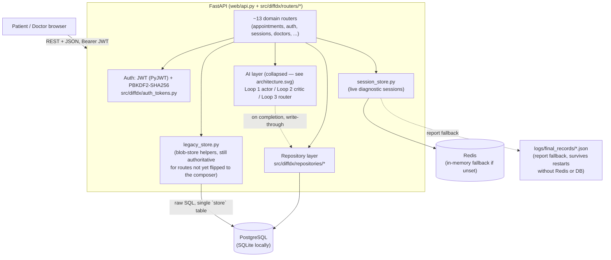

# DiffDx v2 — Architecture

This documents the infrastructure/component layer built out this cutover (persistence, auth,
sessions, deployment) — the AI diagnostic engine itself (the Loop 1 actor / Loop 2 critic / Loop 3
router three-loop design) is unchanged and out of scope here; see the root `README.md` and
`architecture.svg` for that side, and the "Three-Loop Structure" section of this file's sibling,
the top-of-`README.md` "How the Actor/Critic/Router works" sections, for its own diagram.

## Component diagram

**Two data paths coexist deliberately, not as a bug**: the relational schema (`src/diffdx/db/
models/`, reached via the repository layer) is authoritative for identity and for every
appointment field that's been dual-written and flipped to read from it (see the appointments
cutover's `TASK6`-`TASK21` docs at the repo root). The original single-table JSON blob store
(`store(collection, data)`, read/written via `legacy_store.py`'s `_db_load`/`_db_save`) remains
authoritative for everything not yet flipped — deliberately, so the migration could proceed one
route at a time with a working system at every commit, rather than one big-bang cutover.

## Request lifecycle — one example, direct-booking an appointment

`POST /api/patient/book-direct` (`src/diffdx/routers/appointments3.py::book_direct`):

1. **Auth**: `Depends(get_current_user)` (`src/diffdx/dependencies.py`) decodes the `Authorization:
   Bearer <token>` header via `diffdx.auth_tokens.decode_access_token` (JWT, HS256, `SECRET_KEY`),
   resolves the user via `UserRepository.get_by_id` against Postgres/SQLite.
2. **Router**: validates the requested slot against the (still blob-sourced) doctor directory and
   blocked dates, constructs the appointment record.
3. **Write, blob first**: `_save_appointments(...)` writes the full appointment dict into the
   blob's `appointments` collection — this is still what every read route not yet flipped serves
   from, so it happens unconditionally, first, and is never allowed to fail silently.
4. **Dual-write, best-effort**: `AppointmentRepository(db).book(...)` inserts the matching
   `Appointment` row for real — inside a `try/except Exception: db.rollback();
   _log.warning(...)` that can never affect the response the blob write already produced. (Routes
   that mutate an *existing* appointment instead of creating one, e.g. `propose_reschedule`, call
   `_ensure_relational_appointment` first to self-heal a row for appointments booked before this
   dual-write existed — booking itself always creates fresh, so no self-heal is needed here.) This
   relational row is what makes the `UNIQUE (doctor_id, slot_datetime)` partial index actually
   prevent double-booking (see `docs/DECISIONS.md` and `TASK3_CONCURRENCY_PROOF.md`/
   `TASK7_BOOKING_CONCURRENCY_FIX.md` at the repo root) — the blob write alone has no such
   guarantee.
5. **Response**: built from the blob record (still the read-side source of truth for this route).

A diagnostic-session turn (`POST /api/session/{id}/turn`) follows a parallel but separate path:
`session_store.get_session`/`save_session` (Redis or in-memory) holds the live `APISession`
object across the multi-turn conversation; on completion, `_persist_completed_session`
write-throughs to `DiagnosticSessionRepository` (Postgres) — see `TASK22_REDIS_SESSIONS.md`.

## Why the blob store was replaced

The single `store(collection, data)` table had no transactions, no indexes, no foreign keys, and
every write was read-whole-collection → mutate in Python → write-whole-collection — a textbook
lost-update race. `TASK3_CONCURRENCY_PROOF.md` demonstrates this concretely: 20 concurrent booking
requests against the blob path all returned `200 OK`, but only 1 of the 20 bookings actually
survived — 19 were silently overwritten. The relational schema's partial unique index
(`(doctor_id, slot_datetime)` excluding cancelled rows) makes the same scenario produce exactly 1
success and 19 clean `409 Conflict`s, enforced by the database itself rather than hoped-for in
application code.

## Why sessions moved to Redis

`_sessions: dict[str, APISession]` held every live (in-progress) diagnostic conversation in
process memory. Two direct consequences: a server restart mid-consultation lost the session
entirely (no way to resume), and it made horizontal scaling (multiple API replicas behind a load
balancer) impossible — a request routed to replica B would find no trace of a session that started
on replica A. `session_store.py` moves this to Redis (shared across replicas, survives a restart
of any one instance) with a graceful in-memory fallback for local dev when `REDIS_URL` is unset —
see `TASK22_REDIS_SESSIONS.md` for the serialization design and the two correctness hazards found
and fixed while building it (an in-place-mutation write-back gap, and an async background-thread
write reaching the store).
